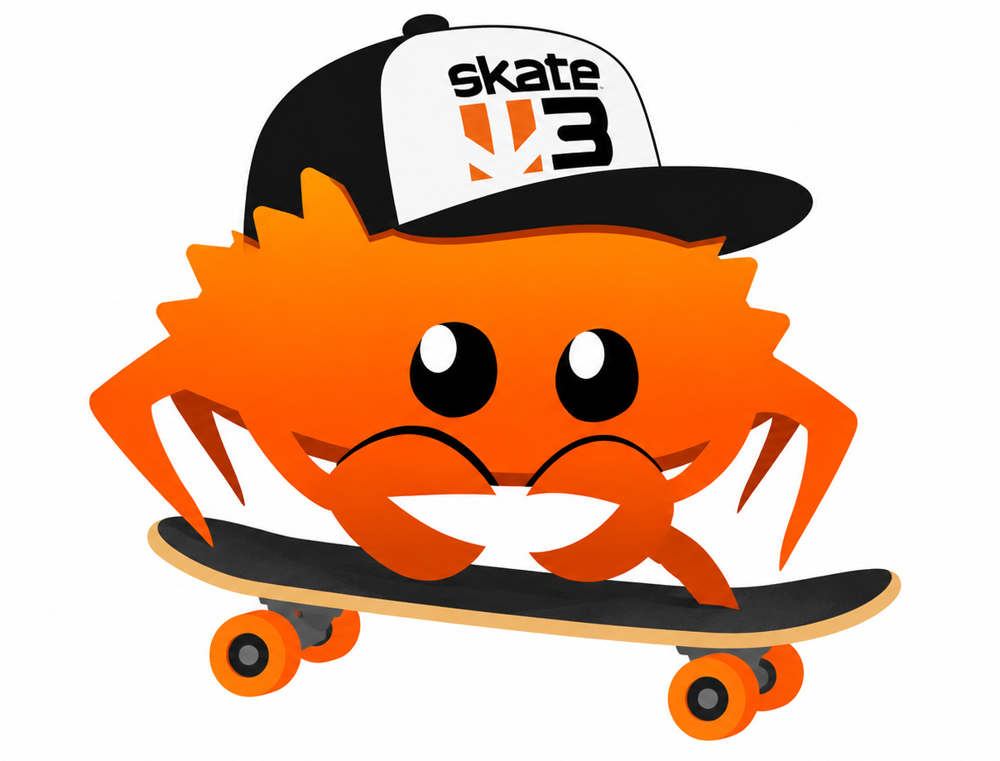

  

# Skate 3 Imported

A Rust and Bevy skating project built from Skate 3 reverse-engineering research.
Includes skating, tricks, grinds, offboard movement, difficulty settings and
`.skate` map support. Gameplay parity is still a work in progress.

## Build and run

Requires Windows, Rust with the MSVC toolchain, and LLVM installed in its default
location. Run `BUILD.bat` to build, then `PLAY.bat` to launch the test world.
Use `PLAY-MAP.bat` to select a map. An XInput controller is required for gameplay;
Escape opens difficulty and graphics settings.

**Skate 3 assets are not included.** Running the game requires a separately
prepared local asset set in `assets/private/`, including its `game.json`
manifest, character, animation banks, graphs and gameplay data. This repository
does not include an asset extraction pipeline. A source checkout alone cannot
run the game.

Custom animations and climbing support remain available, but no custom clips
are shipped. The included format-demo map is original procedural content.

Implementation notes are in [`docs/`](docs/). Patched Bevy dependencies and
their licenses are in [`vendor/`](vendor/). This is an unofficial project,
not affiliated with EA.
