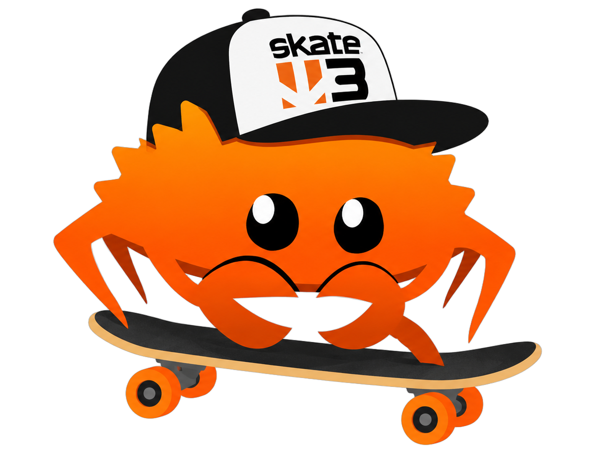

<p align="center">
  
</p>

# Skate 3 Rust Engine

A Rust and Bevy skating project built from Skate 3 reverse-engineering research.
Includes skating, tricks, grinds, offboard movement, difficulty settings and
`.skate` map support. Gameplay parity is still a work in progress.

## Play

[Download Experimental](https://github.com/SK8-ENGINE/skate-3-rust-engine/releases/tag/experimental).
Successful `main` builds replace this prerelease. Choose **Latest** in Updates
for experimental updates; **Stable** is the default.

Extract the Windows release ZIP and run `skate3rust.exe`. Select your Skate 3
Xbox 360 ISO, or select `default.xex` in an extracted game folder. Keep its
`data` folder alongside it. Setup prepares the skater, animations and all disc maps, then
starts University. The original scoring and session-marker HUD assets are also
exported automatically during setup. No Blender, Python or Rust installation is needed.
ISO extraction needs internet access. The first conversion can take a while.

Use an XInput controller to play. Escape opens graphics, difficulty and map
settings. Maps can be switched without restarting the game.

**Skate 3 assets are not included.** Your converted files stay in
the `data` folder beside your executable. Each freshly unpacked copy runs its
own setup; it does not adopt another installation. In-place updates refresh
only changed asset groups.

## Build

### Windows

Requires Windows, Rust with the MSVC toolchain, and LLVM installed in its default
location. Run `BUILD.bat` to build, then `PLAY.bat` to launch the test world.
`PLAY.bat` opens your saved map (University by default); use the in-game menu to switch maps, or drag a `.skate` file onto `PLAY.bat`. An XInput controller is required for gameplay;
Escape opens difficulty and graphics settings.

Development builds use a prepared asset set in `assets/private/` or the
installed asset directory. `scripts/Build-Release.ps1` builds the portable Windows
package and requires Python 3.13. GitHub Actions builds `main` automatically;
numbered releases are published separately.

### macOS and Linux

Install [Nix](https://nixos.org/download) and [devenv](https://devenv.sh/getting-started/),
then enter the development shell with `devenv shell`. With
[direnv](https://direnv.net/), run `direnv allow` once and the shell loads on `cd`.
The shell provides stable Rust, Python 3.13 with the setup packages, and
`extract-xiso`. It also provides the Vulkan loader and MoltenVK on macOS, and the
Vulkan, X11/Wayland, ALSA and udev libraries on Linux. Entering the shell
installs pre-commit hooks that run `cargo check --workspace --locked` for Rust
changes and `nixfmt` for Nix files.

```sh
skate-setup path/to/Skate3.iso   # or .../default.xex; preflight, build, asset setup
skate-run                        # extra args go to the game, e.g. --map path/to/map.skate
```

`skate-setup` rejects images without an XDVDFS `default.xex` (PS3 discs, for
example), builds the workspace, then converts assets without the setup window
(`tools/setup.py --source`), passing `--refresh` when an installation exists.
`skate-run` launches with the installation recorded in `data/installation.json`
(`skate-assets` prints its path). The manual equivalent:

```sh
cargo build --workspace --locked
# One-time headless asset setup: supply your Skate 3 ISO or default.xex.
python tools/setup.py --base data --game-exe target/debug/skate3rust --source path/to/Skate3.iso
cargo run --bin skate3rust -- --assets data/installations/<id>/assets
```

`<id>` is the directory recorded in `data/installation.json`. Run all of these
inside the shell, including `git commit`: the hooks build with the shell's
toolchain. Setup uses the `extract-xiso` on `PATH`, and the game needs the
shell's Vulkan environment.

`cargo build --release --locked --no-default-features --bin skate3rust` builds a
single optimized binary without Bevy's dynamic linking. On macOS it still loads
the Vulkan loader and MoltenVK at runtime and links libiconv from the Nix store,
so it runs only where those are available (for example inside the shell).

Any gamepad that gilrs recognizes as a standard gamepad works. Its buttons and
sticks map to the XInput layout without deadzones, and devices keep their slot
until they disconnect. On macOS the renderer runs Vulkan through MoltenVK, and
materials use the non-bindless path. The shell sets `MVK_CONFIG_FAST_MATH_ENABLED=0`:
with fast-math, the depth prepass and the main pass disagree on skinned, morphed
customiser skaters, which then render as black-and-white patches. Launching outside
the shell brings that back. The launch scripts (`*.bat`, `scripts/*.ps1`)
and release packaging are Windows-only.

Run the explicit GPU shader probes on macOS with
`SKATE_SHADER_PROBE_FALLBACK=1 cargo test -p skate-game --bin skate3rust _pipeline_probe -- --ignored`.

Custom animations and climbing support remain available, but no custom clips
are shipped. The included format-demo map is original procedural content.

Implementation notes are in [`docs/`](docs/). Patched Bevy dependencies and
their licenses are in [`vendor/`](vendor/). This is an unofficial project,
not affiliated with EA.

## Advanced diagnostics

Windows builds support opt-in [performance timeline capture](docs/performance-tracing.md)
through the `--trace` CLI option, including optional GPU pass diagnostics.
